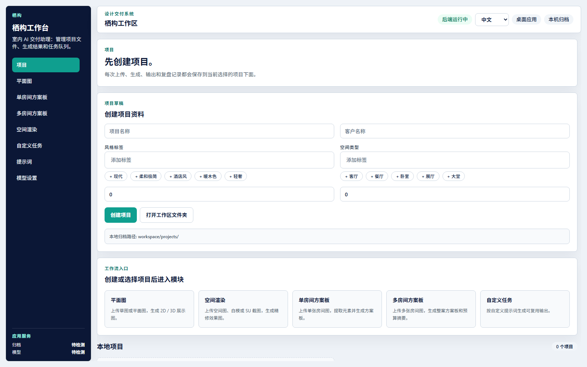
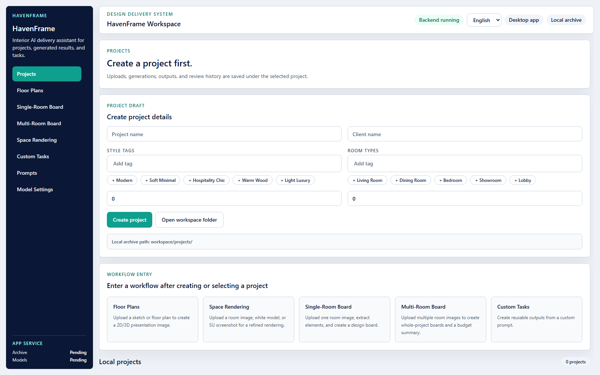

# HavenFrame / 栖构 Desktop

[](https://github.com/BlueVenn6/HavenFrame/actions/workflows/source-validation.yml)

[](https://github.com/BlueVenn6/HavenFrame/releases)
[](LICENSE)

[中文概览](#中文概览) | [English overview](#english-overview) | [中英双语使用说明 / Bilingual user guide](docs/USER_GUIDE_BILINGUAL.md)

## 界面预览 / Interface previews

| 中文界面 | English interface |
|---|---|
|  |  |

两张截图来自同一份生产前端构建和隔离空白数据目录，不包含 API Key、客户资料或历史任务。

Both screenshots come from the same production frontend build and an isolated empty data directory. They contain no API keys, customer data, or historical tasks.

## 中文概览

HavenFrame（中文名：栖构）是面向室内设计交付的中英双语 Windows 桌面工作台。中文和英文界面使用同一套业务逻辑、Provider 路由、任务结构和本地项目数据。

### 功能范围

- 项目与本地归档
- 平面图 2D / 3D 可视化
- 单房间与多房间方案板
- 空间渲染与可选参考图
- 自定义任务与提示词
- 图片生成与多模态元素提取
- A4 方案板报告与结构化采购表导出

桌面界面不提供本地部署、本地模型服务或本地渲染器设置。Windows 应用包含仅监听 `127.0.0.1` 的 FastAPI sidecar，用于项目、任务、资产和用户自备 Key 的 Provider 调用；它属于桌面应用内部基础设施。

### 支持的模型线路

图片生成：

- OpenAI Native API，模型 `gpt-image-2`
- OpenAI-compatible Relay Base URL，模型 `gpt-image-2`
- Google Gemini 图片模型

多模态提取：

- 智谱 GLM（中国大陆）：`https://open.bigmodel.cn/api/paas/v4`
- Z.AI GLM（国际/海外）：`https://api.z.ai/api/paas/v4`
- 用户明确配置的 OpenAI-compatible 视觉中转

中国大陆智谱账号和国际 Z.AI 账号使用不同的 Base URL 与 API Key。界面语言不会改变线路、模型 ID、endpoint、payload 或用户创建的内容。

### 工程结构

- `app/`：React + TypeScript + Vite 前端与 Tauri Windows 桌面壳
- `backend/`：FastAPI、SQLite、任务队列及 Provider adapter
- `scripts/`：本地构建、发布检查与安装版验收工具
- `workspace/`：开发环境本地项目、输出、缓存和临时文件，不提交 Git

### 本地开发

使用 Python 3.12 和 Node.js 22：

```powershell
python -m venv .venv
.venv\Scripts\Activate.ps1
python -m pip install -r backend/requirements.txt

cd app
npm ci
npm run desktop:dev
```

### 验证

```powershell
python scripts/pre-release-check.py
```

也可以分别运行：

```powershell
python -m pytest backend/tests -q

cd app
npm run typecheck
npm run test:i18n
npm run test:model-routing
npm run test:model-selection-runtime
npm run test:independent-board-workflows
npm run test:workflow-history
npm run build
```

这些自动检查不会调用真实付费 Provider。连接测试不等于真实图片生成验收；真实生成必须由用户在产品中明确发起并承担相应费用。

### 本地构建

Windows 安装包只允许在受控本机环境构建，GitHub Actions 不生成或发布二进制：

```powershell
cd app
npm run desktop:build:bundle
```

发布时必须记录 Git commit、构建命令、唯一 artifact 路径、大小、时间和 SHA-256。未实际安装并复现目标场景的 artifact 不能称为最终验收通过。

## English overview

HavenFrame is a bilingual Windows desktop workspace for interior-design delivery. Chinese and English use the same workflows, Provider routes, task schemas, and local project data.

### Features

- Local projects, archives, and history
- 2D/3D floor-plan visualization
- Single-room and multi-room design boards
- Space rendering with optional reference images
- Reusable custom tasks and prompt management
- Image generation and multimodal item extraction
- A4 client reports and structured procurement-table export

The desktop UI does not expose local deployment, local-model management, or a local renderer. The Windows application bundles a loopback-only FastAPI sidecar for projects, tasks, assets, and user-configured Provider calls.

### Supported model routes

Image generation:

- OpenAI Native API with `gpt-image-2`
- OpenAI-compatible Relay Base URL with `gpt-image-2`
- Supported Google Gemini image models

Multimodal extraction:

- Zhipu GLM for Mainland China: `https://open.bigmodel.cn/api/paas/v4`
- Z.AI GLM for international accounts: `https://api.z.ai/api/paas/v4`
- An explicitly configured OpenAI-compatible vision relay

Mainland Zhipu and international Z.AI accounts use different Base URLs and API keys. Interface language never changes a route, model ID, endpoint, payload, or user-created content.

### Development and verification

Use Python 3.12 and Node.js 22. Install backend dependencies from `backend/requirements.txt`, run `npm ci` in `app/`, then execute:

```powershell
python scripts/pre-release-check.py
```

The checks do not call paid Providers. A connection test does not prove that a real image-generation workflow succeeds; a user must explicitly run and pay for any live Provider acceptance test.

Windows installers are built only on an authorized local machine. GitHub Actions validates source but does not publish binary artifacts.

For setup and workflow instructions, read the [bilingual user guide](docs/USER_GUIDE_BILINGUAL.md). For security boundaries, read [SECURITY.md](SECURITY.md); for contributions, read [CONTRIBUTING.md](CONTRIBUTING.md).

## 安全与发布 / Security and release

- 不提交 `.env`、API Key、数据库、客户素材、输出、签名文件或本机路径。
- 中转地址必须使用可信 HTTPS 服务；中转会收到用户明确选择发送的图片和提示词。
- 生成动作必须进入任务队列，失败不得显示为成功。
- API keys, databases, customer assets, outputs, signing files, and local paths must not be committed.
- Relay services receive the images and prompts explicitly selected by the user; only use trusted HTTPS endpoints.
- Generation must enter the task queue, and a failure must never be presented as success.

## 开源许可证 / Open-source license

HavenFrame / 栖构桌面版原创源码以 [GNU Affero General Public License v3.0 or later](LICENSE) 发布。修改、分发或通过网络向用户提供修改版时，必须遵守 AGPL 的源码提供义务。第三方组件保留各自许可证，详情见 [THIRD_PARTY_NOTICES.md](THIRD_PARTY_NOTICES.md)。

Original HavenFrame desktop source code is licensed under the [GNU Affero General Public License v3.0 or later](LICENSE). Third-party components retain their respective licenses; see [THIRD_PARTY_NOTICES.md](THIRD_PARTY_NOTICES.md).
